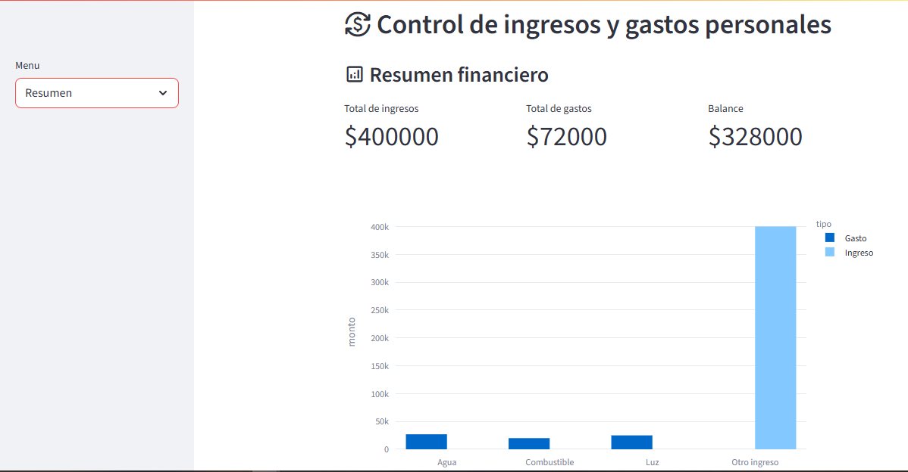

# 💰 Control de Ingresos y Gastos Personales

Aplicación web desarrollada con **Python y Streamlit** para registrar, visualizar y analizar ingresos y gastos personales. Permite tomar decisiones financieras informadas mediante una interfaz sencilla e intuitiva.

---

## 📌 Características

- 📥 Registro de transacciones (ingresos y gastos)
- 📅 Historial filtrable por tipo y rango de fechas
- 📊 Resumen financiero con gráficos interactivos
- 💾 Almacenamiento temporal en memoria (usando `session_state`)
- ⚡ Interfaz moderna con iconos y formularios optimizados

---

## 🖼️ Vista previa




---

## 🚀 Instalación

1. **Clonar el repositorio**

```bash
git clone https://github.com/tuusuario/control-finanzas-streamlit.git
cd control-finanzas-streamlit
```

2. **Crear entorno virtual (opcional pero recomendado)**

```bash
python -m venv env
source env/bin/activate  # en Linux/macOS
env\Scripts\activate   # en Windows
```

3. **Instalar dependencias**

```bash
pip install -r requirements.txt
```

4. **Ejecutar la aplicación**

```bash
streamlit run app.py
```

---

## 🧪 Requisitos

- Python 3.9 o superior
- Streamlit
- Pandas
- Plotly

> Las dependencias están listadas en `requirements.txt`.

---

## 📂 Estructura del Proyecto

```text
control-finanzas-streamlit/
│
├── app.py                  # Archivo principal de la aplicación
├── requirements.txt        # Lista de paquetes necesarios
├── README.md               # Documentación del proyecto
└── assets/
    └── captura.png         # Imagen de ejemplo para la vista previa
```

---

## 📈 Mejoras futuras

- Guardado persistente en archivo CSV o base de datos (SQLite / PostgreSQL)
- Exportación de reportes en PDF / Excel
- Soporte multiusuario con autenticación
- App móvil (WebView o Flutter + API)

---

## 👨‍💻 Autor

- **Fredy Curihual** – [@Javier2829](https://github.com/Javier2829)

---

## 📝 Licencia

Este proyecto se publica bajo la licencia MIT. Consulta el archivo [LICENSE](LICENSE) para más detalles.
